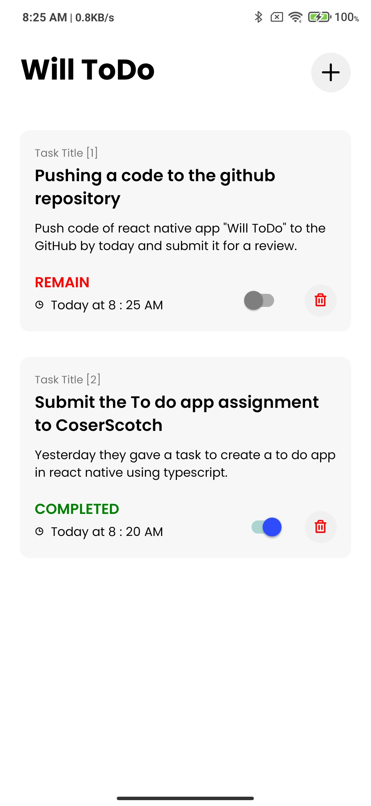
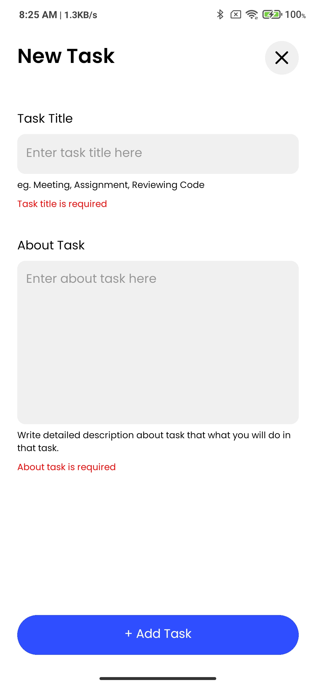

# coderscotch

**Project Name**: `Will ToDo`

## How to Run the Project

1. Open the project directory in to terminal
2. Install all dependencies

   - Run command

   ```bash
   npm install
   ```
3. Install pods (Only iOS)

   - Run command

   ```bash
   npx pod-install
   ```
4. Run and build for either OS

   - Run iOS app

   ```bash
   npx react-native run-ios
   ```

   - Run Android app

   ```bash
   npx react-native run-android
   ```

   - Note: Make sure that you all installed all the other dependecies like JAVA.

## List of all dependencies used in the project with their usage

List all dependencies from the package.json file along with their usage. This list must be updated every time you change/add any dependecy. Here are some examples:

- **Framework:**

  - [react-native](https://github.com/facebook/react-native)
    [react](https://github.com/facebook/react)
  
- **State management libraries:**

  - [redux](http://redux.js.org/), 
    [react-redux](https://react-redux.js.org/), 
    [redux-persist](https://github.com/rt2zz/redux-persist), 
    [@reduxjs/toolkit](https://redux-toolkit.js.org/)

- **Icons:**

  - [phosphor-react-native](https://github.com/duongdev/phosphor-react-native),

- **Validation:**

  - [yup](https://github.com/jquense/yup),
    [formik](https://github.com/jaredpalmer/formik),

- **SVG Support:**

  - [react-native-svg](https://github.com/software-mansion/react-native-svg),

- **Storage:**

  - [@react-native-async-storage/async-storage](https://github.com/react-native-async-storage/async-storage),

- **Utility:**

  - [react-native-uuid](https://github.com/eugenehp/react-native-uuid)

## Will ToDo App Screen-Shots




